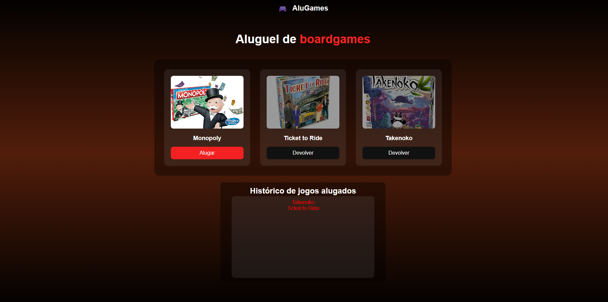

🚀 Sorteador de números

Projeto de aluguel de jogos desenvolvido durante meus estudos na plataforma Alura, com o objetivo de praticar JavaScript, lógica de programação e manipulação do DOM. A aplicação alugar e devolver jogos, junto com histórico de jogos alugados.

📸 Preview

🔗 Demo online

https://tgusbc.github.io/Game/

🛠️ Tecnologias utilizadas

HTML5

CSS3

JavaScript
